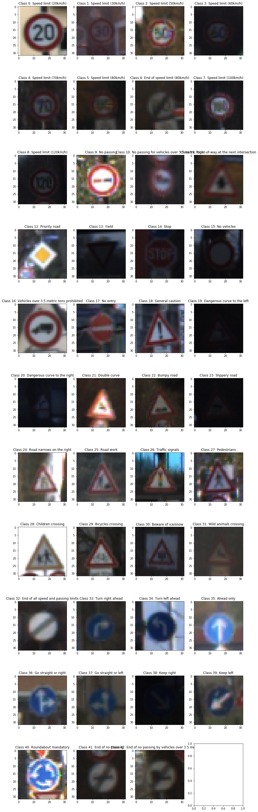
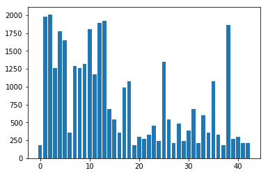
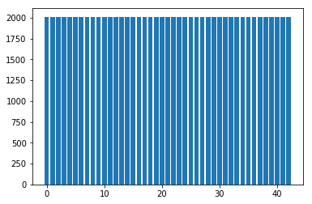
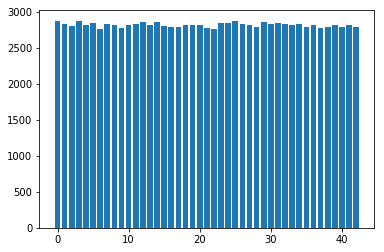
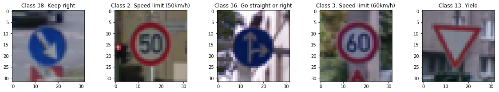

## Project: Build a Traffic Sign Recognition Classifier


## 1.  Dataset Summary & Exploration

### Provide a Basic Summary of the Data Set Using Python, Numpy and/or Pandas

    Number of training examples = 34799
    Number of validation examples = 4410
    Number of testing examples = 12630
    Image data shape = (32, 32, 3)
    Number of classes = 43


The dataset is made of 32x32 RGB images. It is already splitted in three different parts:
- Training datasets: 34799 images
- Validation dataset: 4410 images
- Testing dataset: 12630 images

There are **43** overall different labels in the datasets.

### Exploratory visualization and descriptive analysis




The dataset is evidently unbalanced, as it can be seen from the plot below. It is important to address this to avoid having a biased network towards certain classes.



    25% : 285 samples
    33% : 330 samples
    50% : 540 samples
    67% : 1092 samples
    75% : 1275 samples
    100% : 2010 samples
    Min number of samples: 180
    Max number of samples: 2010

----

## 2. Design and Test a Model Architecture

The following preprocessing steps have been applied, since they consistently improved the validation accuracy:
-  Data Augmentation through rotation and resizing to obtain a balanced datasets
-  A further augmentation step by adding noisy version of some of the images.
- Convert the image from RGB to YUV.
- Select only the Y channel is selected
Normalization has been tried out as well, but since it worsened the performance, it was decided not to add it.

### Dataset augmentation to balance training dataset

It would be desirable to obtain a training dataset where all the classes have an equal number of images. The class with the highest number of samples has 2010 images, so by augmenting the dataset it is possible to retrieve the missing images for having 2010 samples for each classes.
For each classes, as many images as needed to reach 2010 are bootstrap-sampled from the original datasets, then they are jittered in two different ways. The first half is rotated and the second halfed is resized, i.e. zoomed in or out but mantaining the same resolution (this is achieved with a perspective transform). The angle of rotation and the resizing scale are randomly selected for each image from a uniform distribution between two bounding values. The values selected here are [-15, 15] degrees and [0.9,1.1] for the resizing scale, as used in the paper *Taffic Sign Recognition with Multi-Scale Convolutional Networks* by Sermanet and LeCun.




The datasets now contains 86430 samples and it is balanced

### Data augmentation with noise

To make the network more robust, random gaussian noise is added to all the channels. The scale for the normal distribution of the noise becomes thus an hyperparameter of the system. Setting it to **5** returned the best performances among the values considered. The images to be samples are once again bootstrap-sampled from the original datasets.




### From RGB to YUV dataset

The LeNet-5 architecture has been firstly implemented for non-color images, so it performed better on only color channel. This single channel is the Y channel of the YUV color map.

### Model Architecture

The architecture is the classic LeNet-5 architecture, with 2 convolutional + max_pooling layers, and 2 fully connected layers for classification. Only two modification have been added:
- The depth of the two convolutional layers has been doubled to 12 and 32
- Dropout with 25% rate has been added after the second convolutional layer.

Here the table describing the complete architecture layer by layer:

| Layer           | Details                                           |
| --------------- | ------------------------------------------------- |
| Input           | 32x32x1 Y channel of a YUV Image                  |
| Convolution 5x5 | 1x1 strides, same padding, outputs 28x28x12       |
| ReLU            | -                                                 |
| Max Pooling 2x2 | 2x2 strides, outputs 14x14x12                     |
| Convolution 5x5 | 1x1 strides, same padding, outputs 10x10x32 image |
| ReLU            | -                                                 |
| Dropout         | keep probability 75%                              |
| Max Pooling 2x2 | 2x2 strides, outputs 5x5x32                       |
| Flatten output  | Outputs 800x1                                     |
| Fully connected | 120 neurons                                       |
| ReLU            | -                                                 |
| Fully connected | 84 neurons                                        |
| ReLu            | -                                                 |
| Fully Connected | 43 neurons                                        |
| Softmax         | -                                                 |


### Train, Validate and Test the Model

After several attempts, the following hyperparameters have been set:
- Number of epochs: 25
- Batch size: 128
- Learning rate: 0.0009
- Optimizer: Adam

First of all, I run the vanilla LeNet-5 architecture, which performed over 90% validation set. Then I decided, instead of using cross-validation which is very computationally and time expensive, to follow a trial and error approach to seek the best hyperparameters, as well as change in the architecture. 

**Batch size**: The size of 128 appeared to be optimal, so it was left unchanged.

**Learning rate**: Depending on the architecture, diminishing the learning rate in the neighborhood of resulted showed to slightly improve accuracy, but only down to values of 0.0005-0.0006. For the final model architecture, this effect was not so important, so it was just decreased from the initial 0.001 to 0.0009.

**Dropout**: Dropout resulted useful only in small quantity. For example, adding dropout to any of the fully connected layers worsened the accuracy. This is probably due to the size of the architecture, which may not be able to achieve a good performance by shutting down weights. Since it was anyway able to improve the accuracy in small amount, it was added after the second convolutional layer, alongside doubling the size of convolutional filters, in order to achieve a right compromise between model complexity and regularization.

**Epochs**: When dropout is added, the number of epochs needed to train the model increase proportionally. So the number of epochs was increased to 25. For more aggressive dropout, even more epochs were needed.

Changes in the activation functions and in the optimizer were not explored. Extensive research has showed how the ReLU function and the Adam optimizer are the best possible solution for image classification tasks.

### Final results

- Train accuracy: **98.7 %**
- Validation accuracy: **94.4%**

- Test accuracy: **92.0%**

## Step 3: Test a Model on New Images

### Acquiring new images

5 new images of German Traffic Sign have been found on the web. Since they appear in greater pictures, they have been cropped, resized to 32x32 and converted to .png format prior to upload. Despite being apparently easy for our model, they are a bit different from the images in the test set, especially in size. It is expected that the model will not perform well because it was trained on a dataset with particular and recurrent characteristics, not present in these 5 new images.



### Analyze Performance

The model classifies correctly only one image, resulting thus in an accuracy of **20%**. It always classify the images as Speed Limit of 60 Km/h:

| Image                | Prediction          |
| -------------------- | ------------------- |
| Keep Right           | Speed Limit 60 Km/h |
| Speed Limit 50 km/h  | Speed Limit 60 Km/h |
| Go straight or right | Speed Limit 60 Km/h |
| Speed Limit 60 Km/h  | Speed Limit 60 Km/h |
| Yield                | Speed Limit 60 Km/h |

### Output Top 5 Softmax Probabilities For Each Image Found on the Web

```
Image 1: Keep right
1. 30.45% Speed limit (60km/h)
2. 14.44% Turn right ahead
3. 10.14% Speed limit (80km/h)
4. 7.65% Yield
5. 5.59% No passing

Image 2: Speed limit (50km/h)
1. 39.94% Speed limit (60km/h)
2. 11.23% Speed limit (80km/h)
3. 9.92% Turn right ahead
4. 7.06% Yield
5. 5.49% No passing

Image 3: Go straight or right
1. 38.37% Speed limit (60km/h)
2. 8.50% Speed limit (80km/h)
3. 7.85% No passing
4. 6.65% Turn right ahead
5. 6.16% No entry

Image 4: Speed limit (60km/h)
1. 27.17% Speed limit (60km/h)
2. 14.58% Speed limit (80km/h)
3. 13.22% Turn right ahead
4. 8.10% Yield
5. 4.62% Speed limit (70km/h)

Image 5: Yield
1. 29.27% Speed limit (60km/h)
2. 13.88% Turn right ahead
3. 10.64% Speed limit (80km/h)
4. 8.17% No entry
5. 7.82% Yield
```

Even considering the top-5 probabilities, the model struggles to classify the images, showing a preference of classifying all the images in this dataset with the label "Speed Limit 60 km/h". Considering the top5-accuracy, the model passes from the top-1 20% to 40%. Moreover, the model result quite uncertain, since not even one of the top-1 probabilities scores above 40%.

The most probable reason of this decrease of performance is the fact that the images do not come from the same dataset, but they have an embedded difference (e.g. size, color...). These differences may not be grasped by the human eye, but it is absolutely critical to the neural network. The only way to significantly improve the accuracy would be introduce some of the images in the training dataset, or alternatively to find images and process them in such a way they look more similar to the one contained in the training dataset.